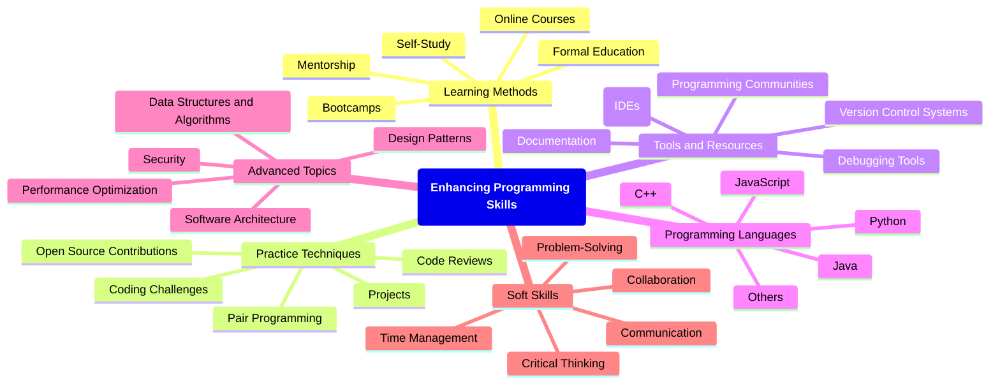
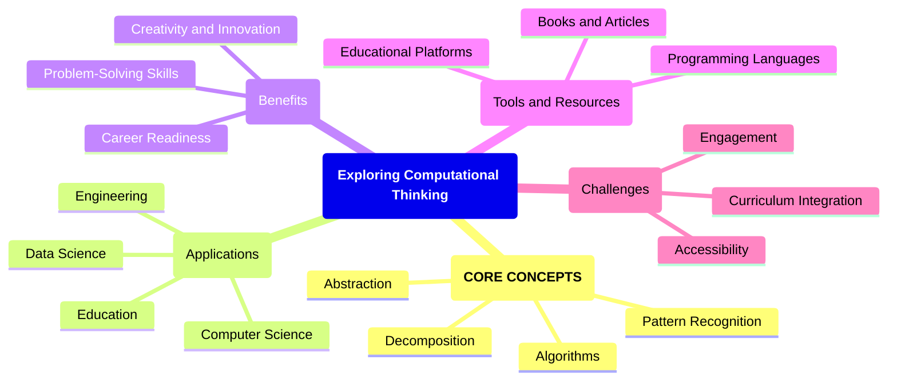
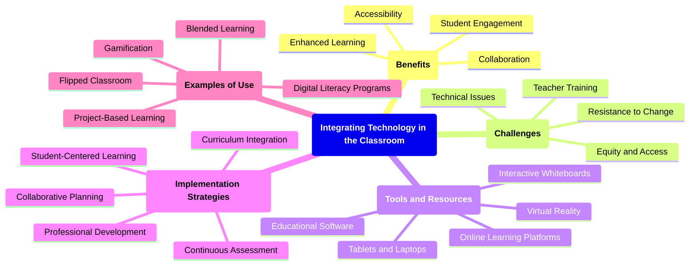
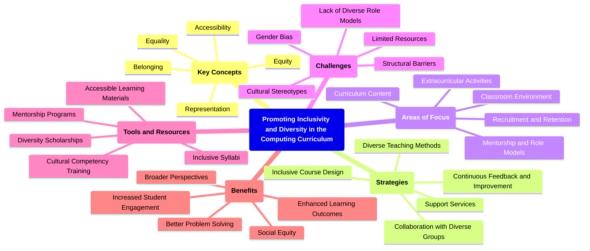
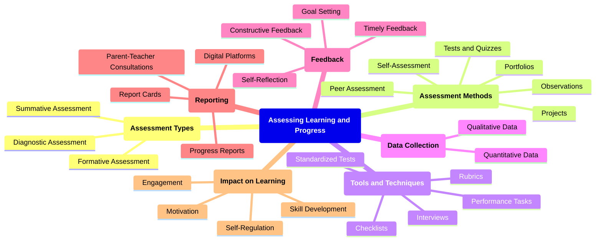
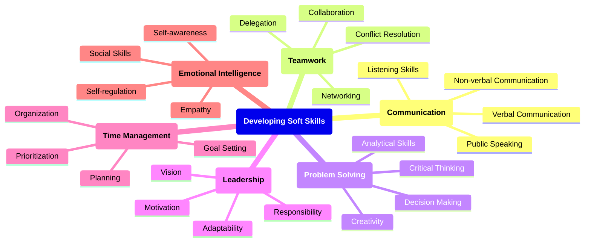
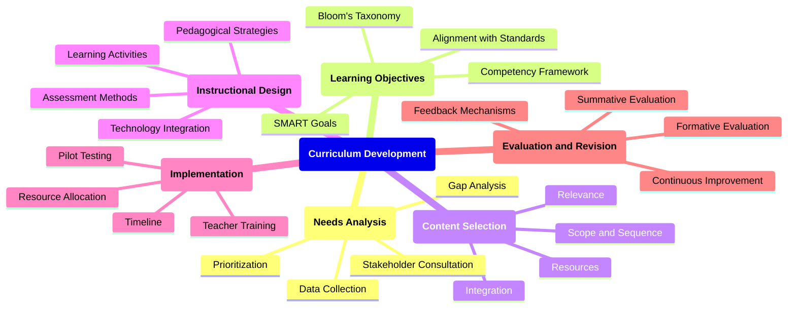
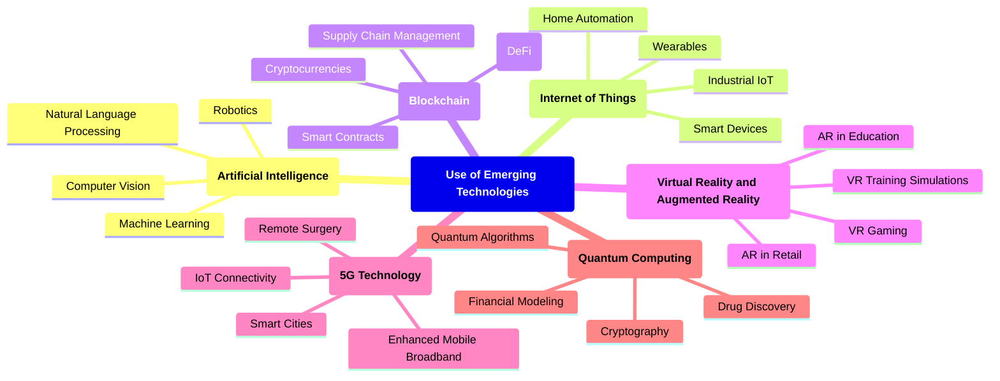
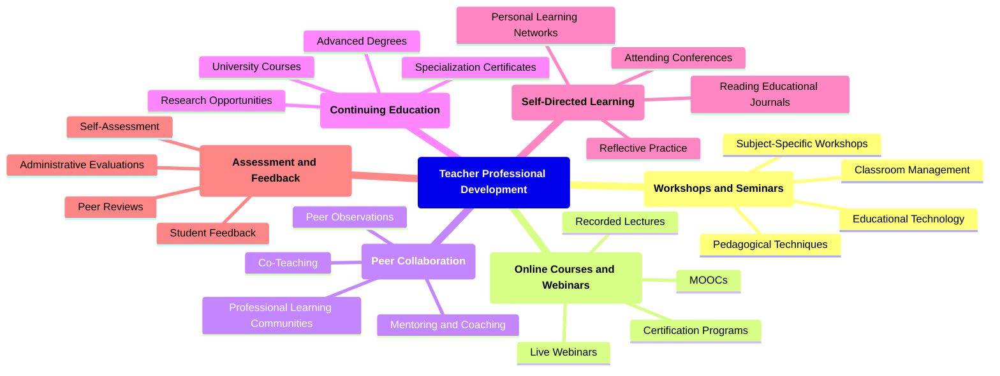
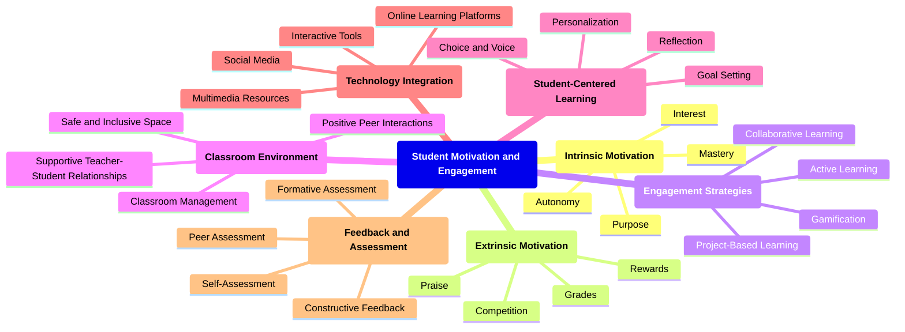

### Enhancing Programming Skills

### Exploring Computational Thinking

### Integrating Technology in the Classroom

### Promoting Inclusivity and Diversity

### Assessing Learning and Progress

### Developing Soft Skills

### Curriculum Development

### Use of Emerging Technologies

### Teacher Professional Development

### Student Motivation and Engagement

