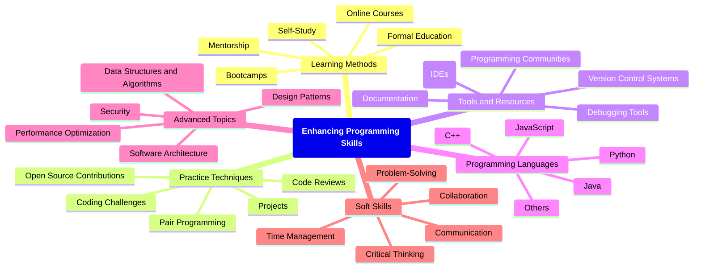
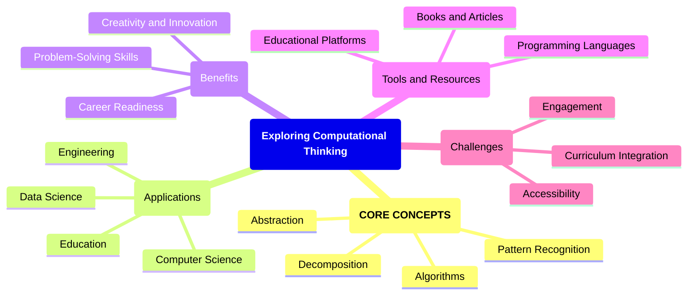
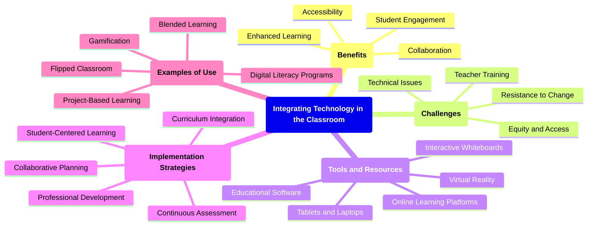
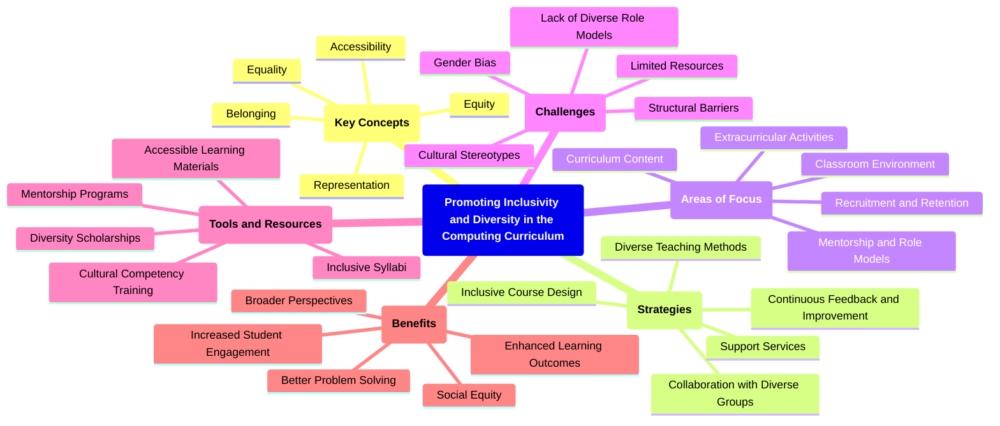

### Enhancing Programming Skills

```mermaid
mindmap
  root(**Enhancing Programming Skills**)
    Learning Methods
      Formal Education
      Online Courses
      Bootcamps
      Self-Study
      Mentorship
    Practice Techniques
      Coding Challenges
      Projects
      Open Source Contributions
      Pair Programming
      Code Reviews
    Tools and Resources
      Integrated Development Environments (IDEs)
      Version Control Systems
      Debugging Tools
      Documentation
      Programming Communities
    Programming Languages
      Python
      JavaScript
      Java
      C++
      Others
    Advanced Topics
      Data Structures and Algorithms
      Design Patterns
      Software Architecture
      Performance Optimization
      Security
    Soft Skills
      Problem-Solving
      Critical Thinking
      Collaboration
      Communication
      Time Management
```

### Exploring Computational Thinking

```mermaid
mindmap
  root(**Exploring Computational Thinking**)
    (**CORE CONCEPTS**)
        Decomposition
        Pattern Recognition
        Abstraction
        Algorithms
    (Applications)
        Computer Science
        Education
        Data Science
        Engineering
    (Benefits)
        Problem-Solving Skills
        Creativity and Innovation
        Career Readiness
    (Tools and Resources)
        Educational Platforms
        Programming Languages
        Books and Articles
    (Challenges)
        Accessibility
        Engagement
        Curriculum Integration
```

### Integrating Technology in the Classroom

```mermaid
mindmap
  root(**Integrating Technology in the Classroom**)
    (**Benefits**)
      Enhanced Learning
      Student Engagement
      Collaboration
      Accessibility
    (**Challenges**)
      Technical Issues
      Teacher Training
      Equity and Access
      Resistance to Change
    (**Tools and Resources**)
      Educational Software
      Interactive Whiteboards
      Tablets and Laptops
      Online Learning Platforms
      Virtual Reality
    (**Implementation Strategies**)
      Professional Development
      Curriculum Integration
      Collaborative Planning
      Student-Centered Learning
      Continuous Assessment
    (**Examples of Use**)
      Flipped Classroom
      Blended Learning
      Project-Based Learning
      Gamification
      Digital Literacy Programs
```

### Promoting Inclusivity and Diversity

```mermaid
mindmap
  root(**Promoting Inclusivity and Diversity in the Computing Curriculum**)
    (**Key Concepts**)
      Equality
      Equity
      Accessibility
      Representation
      Belonging
    (**Strategies**)
      Inclusive Course Design
      Diverse Teaching Methods
      Support Services
      Collaboration with Diverse Groups
      Continuous Feedback and Improvement
    (**Areas of Focus**)
      Curriculum Content
      Classroom Environment
      Extracurricular Activities
      Mentorship and Role Models
      Recruitment and Retention
    (**Challenges**)
      Gender Bias
      Cultural Stereotypes
      Lack of Diverse Role Models
      Limited Resources
      Structural Barriers
    (**Tools and Resources**)
      Inclusive Syllabi
      Accessible Learning Materials
      Cultural Competency Training
      Mentorship Programs
      Diversity Scholarships
    (**Benefits**)
      Enhanced Learning Outcomes
      Increased Student Engagement
      Broader Perspectives
      Better Problem Solving
      Social Equity
```